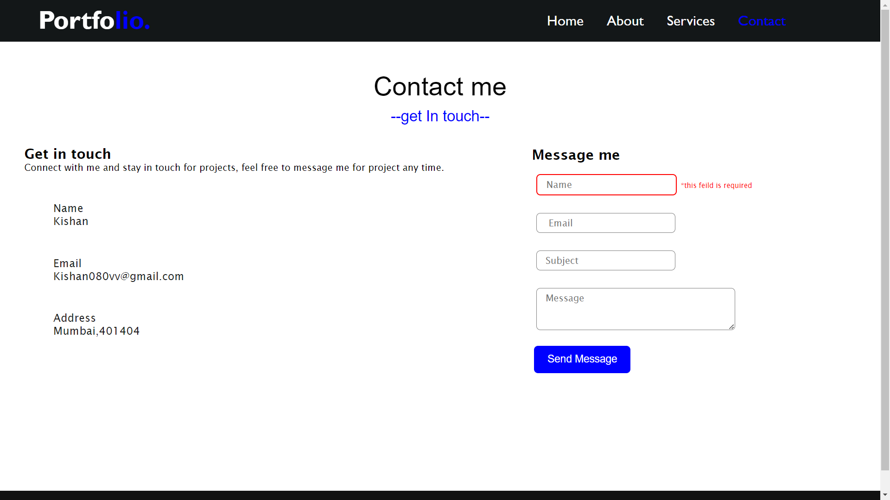

# Portfolio_website

Using HTML ,CSS and basic JavaScript created a Portfolio website consist of four pages.

## Home page

## About page

About me Section

## About page

About my skill Section

## Service page

## Contact us page

Contact us page with client side Form validation

